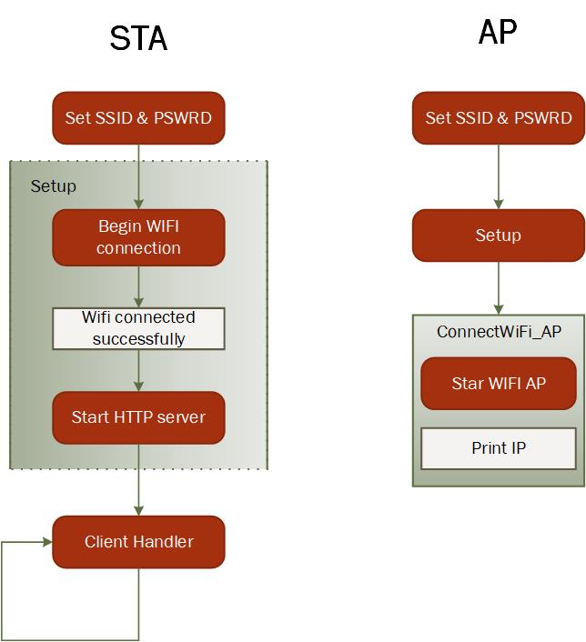
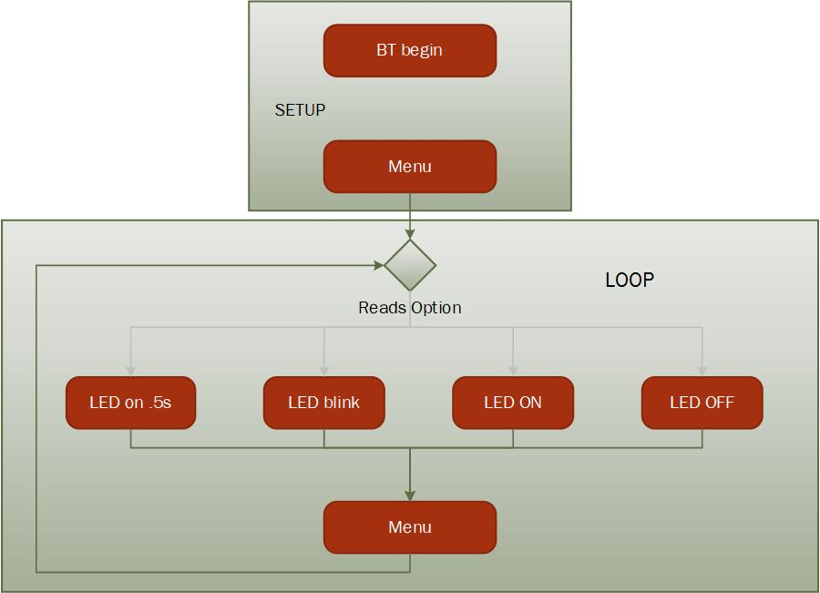

# PRACTICA 3  :  CONEXIONES WIRELESS

En esta practica hemos implementado la placa ESP 32 para que se pueda connectar sin uso de medio físico.

* **Parte 1) Conexion WIFI**
 1. STA mode (Station)
 2. AP mode (Acces Point)

* **Parte 2) Conexión Bluetooth** 
 1. Control LED mediante dispositivo bluetooth (mobil)
 2. Servicio BLE 


# Parte 1: Wifi

* ## STA mode

En este codigo mostramos como realizar la conexión de la placa ESP 32 a una wifi existente (modo station)

En la cabezera declaramos las librerías de Wifi necesarias. 

Declaramos las variables globales que contienen el nombre y contrasña de la wifi a la que nos vamos a conectar. 

Declaramos tambien la funcion handle_root que sirve para enviar el texto HTML al servidor creado. 

```cpp
#include <WiFi.h>
#include <WebServer.h>

// SSID & Password
const char* ssid = "Pau"; // Enter your SSID here
const char* password = "12345678"; //Enter your Password here
WebServer server(80); // Object of WebServer(HTTP port, 80 is defult)

// HTML & CSS contents which display on web server
String HTML = "INSERIR AQUÍ TEXTO FORMATO HTML";

// Handle root url (/)
void handle_root() {
server.send(200, "text/html", HTML);
}
```

En el setup inciamos la conexión wifi.
Mostramos por pantalla la IP y nombre de la wifi a la que se contecta. 
Tras esto ejecuta la función *handle_root* y crea el servidor HTML en la IP conectada. 
```cpp

void setup() {

Serial.begin(9600);
Serial.println("Try Connecting to ");
Serial.println(ssid);
// Connect to your wi-fi modem
WiFi.begin(ssid, password);
// Check wi-fi is connected to wi-fi network
while (WiFi.status() != WL_CONNECTED) {
delay(1000);
Serial.print(".");
}

Serial.println("");
Serial.println("WiFi connected successfully");
Serial.print("Got IP: ");
Serial.println(WiFi.localIP()); //Show ESP32 IP on serial
server.on("/", handle_root);
server.begin();
Serial.println("HTTP server started");
delay(100);
}
```

Finalmente ejecutamos la accion del cliente. 

```cpp
void loop() {

server.handleClient();

}
```

* ## AP mode

Ahora en vez de conectar a una wifi, la placa será la emisora de esta. 

Nombramos el nombre del wifi a generar y la contraseña requerida para la conexión. 

Para que el setup sea mas sencillo, implementamos la funcion *ConnectWiFi_AP()* en la cabezera. Ésta genera el modo de wifi tipo AP y tras esto da el nombre de la wifi generada y su IP. 
Solo hace falta implementar en el *setup* la funcion mencionada para crear el servico AP. 

```cpp
#include <WiFi.h>
#include <WebServer.h>

const char* ssid     = "ESPdePAU";
const char* password = "12345678";

void ConnectWiFi_AP()
{ 
   Serial.println("");
   WiFi.mode(WIFI_AP);
   while(!WiFi.softAP(ssid, password))
   {
     Serial.println(".");
     delay(100);
   }
 
   Serial.println("");
   Serial.print("Iniciado AP:\t");
   Serial.println(ssid);
   Serial.print("IP address:\t");
   Serial.println(WiFi.softAPIP());
}
 
void setup() 
{
  Serial.begin(9600);
  
  ConnectWiFi_AP();
}
 
void loop() 
{ 
}
```
* ## Diagrama de flujo. Wifi STA - AP



# Parte 2: Conexión Bluetooth

* ## Control de LED mediante bluetooth

A través del bluetooth podemos dar ordenes a la mirco para que realize una opcion u otra.
En este caso hay 4 funcionalidades para el control del LED y se controlan con un menú interactivo. 

Primero declaramos las librerías necesarias, el pin de LED y el serial de bluetooth. 

```cpp
#include <Arduino.h>
#include "BluetoothSerial.h"

#if !defined(CONFIG_BT_ENABLED) || !defined(CONFIG_BLUEDROID_ENABLED)
#error Bluetooth is not enabled! Please run `make menuconfig` to and enable it
#endif

BluetoothSerial SerialBT;
int LED=2;
```

En el setup le ponemos nombre al dispositivo y lo inicializamos. 

Tras esto se mostrará el menú y las indicaciones para usar el programa. 

```cpp
void setup() {
  Serial.begin(9600);
  SerialBT.begin("ESP32test"); //Bluetooth device name
  Serial.println("The device started, now you can pair it with bluetooth!");
  
  pinMode(LED, OUTPUT);
  Serial.println("When connected, select an option");
    Serial.println();
    Serial.println("1. LED on 500ms.");
    Serial.println("2. LED blink 3000ms.");
    Serial.println("3. LED on.");
    Serial.println("4. LED off.");
}
```

El funcionamiento esencial del programa está escrito directamente en el loop. 

Tras detectar un señal en el SerialBluetooth realiza la opcion deseada y vuleve a mostrar el menú para seguir utilizando el programa. 

```cpp
void loop() {
  if (Serial.available()) {
    
    SerialBT.write(Serial.read());
  }  

  if (SerialBT.available()) {
    Serial.println();
    
    char opc;
    
    opc=SerialBT.read();
    Serial.print("Option "); Serial.print(opc); Serial.println(" selected");

    if(opc=='1'){
      digitalWrite(LED,HIGH);
      delay(2000);
      digitalWrite(LED,LOW);
      }
    else if(opc=='2'){
      int i=0;
      while(i<6){ 
      digitalWrite(LED,HIGH);
      delay(500);
      digitalWrite(LED,LOW);
      delay(500);
      i++;}

    }
    else if(opc=='3'){
      digitalWrite(LED,HIGH);
      delay(500);
    }  
    else if(opc=='4'){
      digitalWrite(LED,LOW);
      delay(500);
    }
    else  {Serial.println("Option does not match delimiters.");} 

    opc=SerialBT.read();
    opc=SerialBT.read();

    Serial.println();
    Serial.println("Select new option");
    Serial.println("1. LED on 2000ms.");
    Serial.println("2. LED blink 3000ms.");
    Serial.println("3. LED on.");
    Serial.println("4. LED off.");
    
  }
}
```

## Diagrama de flujo



* ## Bluetooth Low Energy

En este apartado se implementa una conexión bluetooth de muy bajo consumo utilizada para que el dispositivo pueda ser inalámbrico y funcionar mientras está en "sleep mode". 

Primero declaramos las librerías necesarias para el funcionamiento en BLE.  
Tras esto definimos los codigos (hexadecimal) del servicio que queramos así como sus características. Puede ser un servicio universal (como el control de batería) o uno único como en este caso. 

```cpp
#include <BLEDevice.h>
#include <BLEUtils.h>
#include <BLEServer.h>
#include <Arduino.h>

// See the following for generating UUIDs:
// https://www.uuidgenerator.net/

#define SERVICE_UUID        "4fafc201-1fb5-459e-8fcc-c5c9c331914b"
#define CHARACTERISTIC_UUID "beb5483e-36e1-4688-b7f5-ea07361b26a8"
```

En el setup inicializamos el BLE y la característica que utilizaremos (pueden ser más de una).
Tambien deberemos crear un canal de "Advertisements" para poder enviar paquetes de datos. 


```cpp
void setup() {
    
    Serial.begin(9600);
    Serial.println("Starting BLE work!");

  BLEDevice::init("BLE PAU");
  BLEServer *pServer = BLEDevice::createServer();
  BLEService *pService = pServer->createService(SERVICE_UUID);
  BLECharacteristic *pCharacteristic = pService->createCharacteristic(
                                         CHARACTERISTIC_UUID,
                                         BLECharacteristic::PROPERTY_READ |
                                         BLECharacteristic::PROPERTY_WRITE
                                       );

  pCharacteristic->setValue("Hello World says Neil");
  pService->start();
  // BLEAdvertising *pAdvertising = pServer->getAdvertising();  // this still is working for backward compatibility
  BLEAdvertising *pAdvertising = BLEDevice::getAdvertising();
  pAdvertising->addServiceUUID(SERVICE_UUID);
  pAdvertising->setScanResponse(true);
  pAdvertising->setMinPreferred(0x06);  // functions that help with iPhone connections issue
  pAdvertising->setMinPreferred(0x12);
  BLEDevice::startAdvertising();
  Serial.println("Characteristic defined! Now you can read it in your phone!");
}

void loop() {
  // put your main code here, to run repeatedly:
  delay(2000);
}
```


